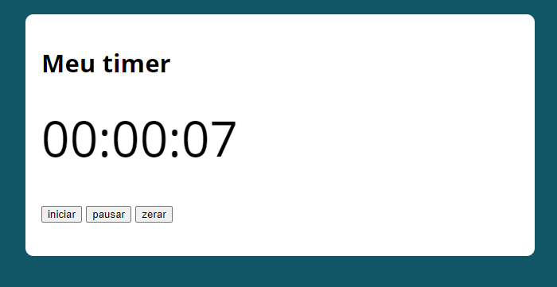

# cronometro
Esse projeto utiliza JavaScript para simular um cronômetro

## Minha aplicação:

# Sobre a aplicação:

Projeto criado para demonstrar uma funcionalidade simples utilizada em várias aplicações. Também explora a lógica de programação 
referente a funcionalidades da linguagem JavaScript que manipula o tempo.

# Por que essa aplicação?

Aplicação criada para desenlvolver a logica de programação e o portfólio pessoal.
